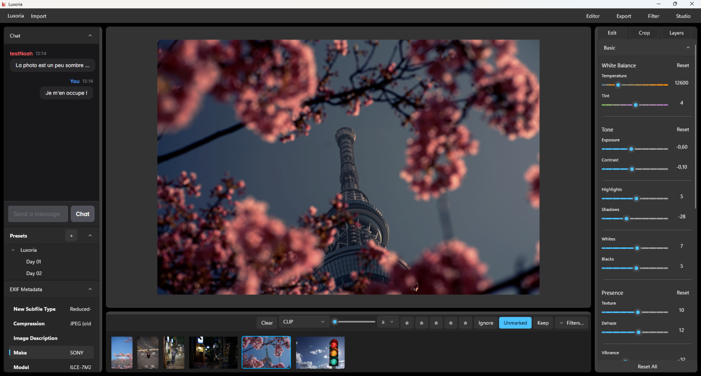

# LuxEditor  
The Standard Editing Module  

---

## ✨ Features
- **Non-Destructive Editing**  
  Every change is stored as adjustments/layers—your originals stay untouched.

- **Core Adjustments**  
  White balance (Temperature/Tint), Exposure, Contrast, Highlights/Shadows, Whites/Blacks.

- **Presence & Color Control**  
  Texture, Dehaze, Vibrance, Saturation for quick pop without overcooking.

- **Pro Tone Curve**  
  Intuitive curve editor (RGB & channels) for precise tonal shaping.

- **Crop & Layers**  
  Fast cropping plus layer-based workflows for organized edits.

- **Subject Recognition (Mask-Ready)**  
  Kickstart local edits with one-click subject detection.

- **Presets & Quick Culling**  
  One-click looks, star/flag tools, and a film-strip for rapid review.

- **Inline EXIF/Metadata Viewer**  
  See camera data while you edit—no context switching.

- **Reset & Compare, Undo/Redo**  
  Confidence to experiment, with instant safety nets.

- **Clean, Focused UI**  
  Editor, Crop, Layers, Export tabs—everything where you expect it.

---

## 📂 How It Works
1. **Open**  
   Pick photos from your Collection Importer (LuxImport)

2. **Filter**  
    Thanks to LuxFilter, apply filters (quality, scores, ranking, etc.) to select the best subset

3. **Adjust**  
   Start with Basic (WB, Tone, Presence), then refine with Curve or Layers.

4. **Mask**  
    Manual masks for targeted edits.

5. **Export**  
   Send to Export with your preferred format and quality settings.

---

## 📌 Coming Soon
- Customizable shortcuts and a lightweight plugin API

---

## 📄 License
`Luxoria and all standard modules are licensed` under the `Apache 2.0` License.  
See the [LICENSE](https://docs.luxoria.bluepelicansoft.com/LICENSE) for details.

[Source Code](https://github.com/LuxoriaSoft/Luxoria/tree/main/Modules/LuxEditor)

---

Feel free to contribute or open issues - LuxEditor evolves with your feedback!
